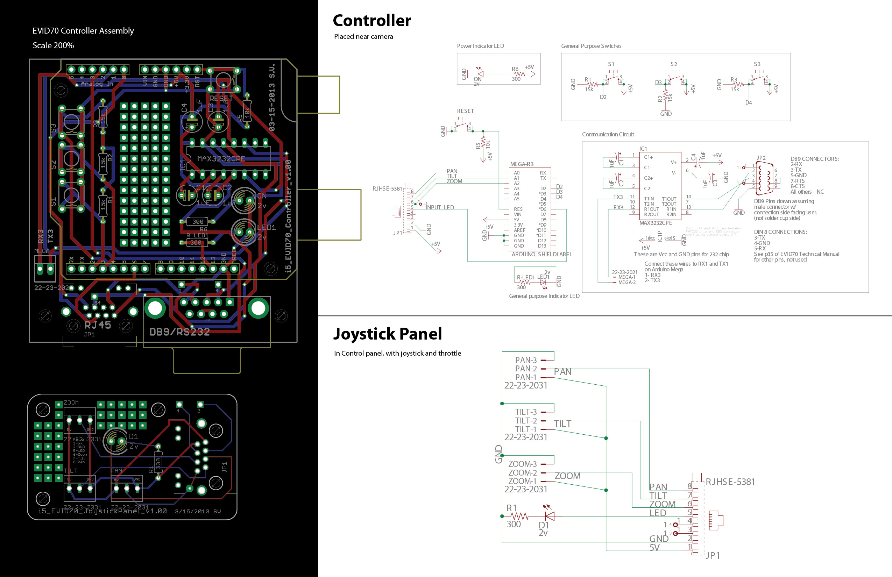
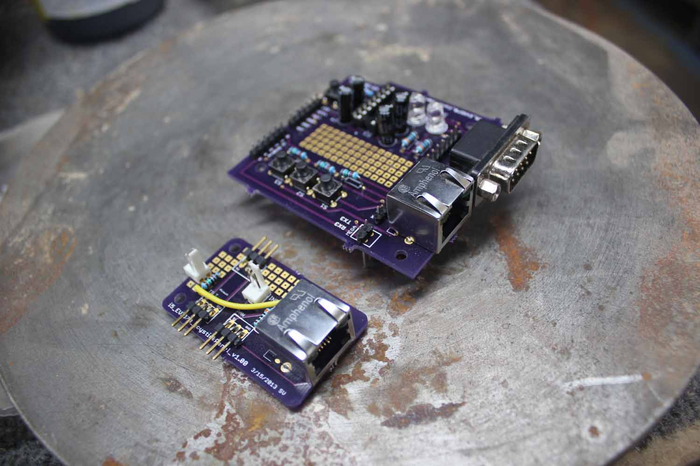

# Arduino_VISCA

**Intent:**  
Control a Sony VISCA-compatible Pan-Tilt-Zoom (PTZ) Camera with an Arduino, if you're into that sort of thing.

**Disclaimers:**
- Last built and tested in 2015 using ~Arduino 2.1, so it's possible things have changed since then 🙏
- This code will make most programmer's / EE's eyes bleed.  Despite that, I'm sharing it in case it saves anyone time & trouble!
- Developed and tested with a Sony EVID-70, but it should work with any camera using the VISCA protocol via RS-232.

**Usage:**  
VISCA_Controller_v1_02.ino is the main file.  All other files contain functions.

## Circuit Diagram:

## Controller Photo:

## Sony EVID-70

